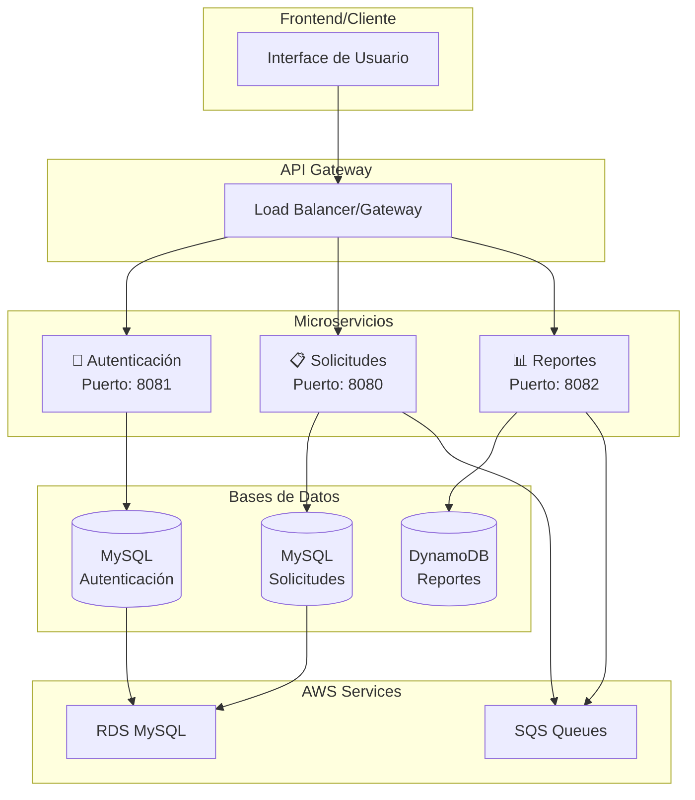
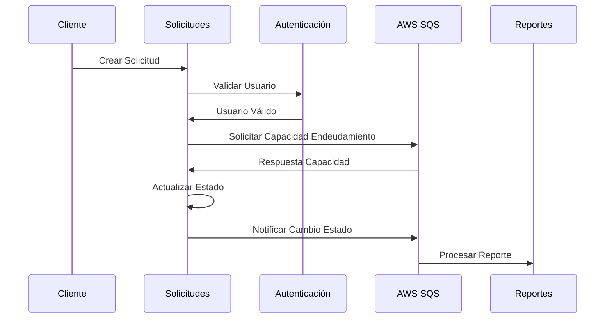
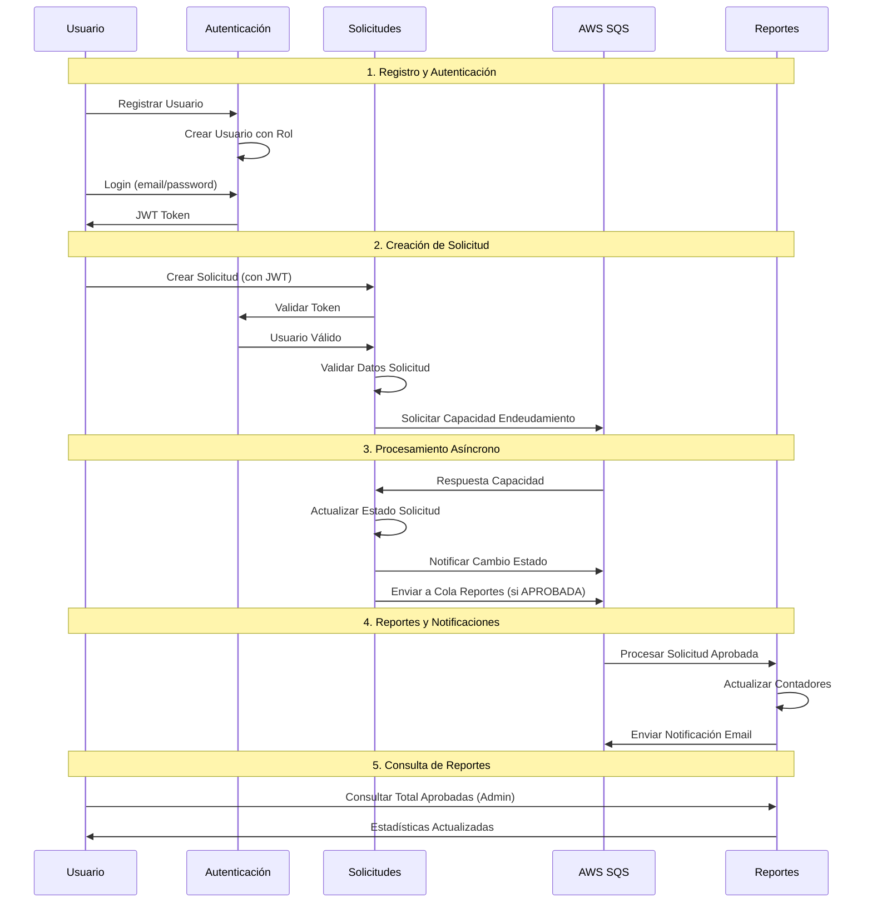

# 🏦 Crediya - Sistema de Gestión de Créditos


## 🎯 Descripción del Proyecto

**Crediya** es un sistema completo de gestión de créditos desarrollado como proyecto final del **Bootcamp Java de Pragma**. El sistema implementa una arquitectura de **microservicios reactivos** utilizando **Clean Architecture** con **Scaffold Architecture Clean** y servicios de **AWS** para crear una solución robusta, escalable y de alta disponibilidad.

El proyecto demuestra la implementación de patrones modernos de desarrollo incluyendo **programación reactiva**, **arquitectura hexagonal**, **event-driven architecture** y **cloud-native patterns**.

## 🏗️ Arquitectura del Sistema

### Diagrama de Arquitectura



### Principios Arquitectónicos

- **🧅 Clean Architecture**: Separación clara de responsabilidades en capas
- **⚡ Programación Reactiva**: Spring WebFlux y Project Reactor
- **🎯 Domain Driven Design**: Modelado basado en el dominio de negocio
- **🔄 Event-Driven Architecture**: Comunicación asíncrona mediante eventos
- **☁️ Cloud-Native**: Diseño para despliegue en la nube
- **🐳 Containerización**: Docker para portabilidad y escalabilidad

## 🚀 Microservicios

### 🔐 1. Microservicio de Autenticación (`crediya-autenticacion`)

**Puerto**: 8081 | **Base Path**: `/auth/api/v1`

#### Funcionalidades Principales:
- ✅ **Registro de Usuarios**: Creación de nuevos usuarios con roles
- 🔑 **Autenticación JWT**: Login con email/contraseña y generación de tokens
- 🛡️ **Validación de Tokens**: Verificación y validación de JWT
- 👥 **Gestión de Usuarios**: Consulta de usuarios por email y rol
- 🔒 **Control de Acceso**: Autorización basada en roles (ADMIN, ASESOR, CLIENTE)

#### Endpoints Principales:
| Método | Endpoint | Descripción | Autenticación |
|--------|----------|-------------|---------------|
| POST | `/login` | Iniciar sesión | Público |
| POST | `/usuarios` | Registrar usuario | ADMIN/ASESOR |
| GET | `/usuarios/cliente` | Consultar por email | CLIENTE |
| POST | `/usuarios/auth/validate` | Validar token | Público |
| GET | `/usuarios/rol/{rolId}` | Listar por rol | ASESOR |

#### Tecnologías Específicas:
- **Base de Datos**: MySQL (R2DBC)
- **Seguridad**: Spring Security Reactive + JWT
- **Encriptación**: BCrypt para contraseñas

---

### 📋 2. Microservicio de Solicitudes (`crediya-solicitudes`)

**Puerto**: 8080 | **Base Path**: `/sol/api/v1`

#### Funcionalidades Principales:
- 📝 **Creación de Solicitudes**: Registro de nuevas solicitudes de crédito
- 📊 **Gestión de Estados**: Cambio de estados (PENDIENTE → APROBADA/RECHAZADA)
- 📋 **Listado de Solicitudes**: Consulta de solicitudes por usuario
- 🔍 **Validación de Capacidad**: Verificación de endeudamiento via SQS
- 📬 **Notificaciones**: Envío de notificaciones de cambios de estado
- 🎯 **Integración Externa**: Consumo del servicio de autenticación

#### Endpoints Principales:
| Método | Endpoint | Descripción | Autenticación |
|--------|----------|-------------|---------------|
| POST | `/solicitud` | Crear solicitud | JWT |
| GET | `/solicitud/listar` | Listar solicitudes | JWT |
| PUT | `/solicitud/{id}` | Cambiar estado | JWT |

#### Tecnologías Específicas:
- **Base de Datos**: MySQL (R2DBC)
- **Mensajería**: AWS SQS (Sender/Listener)
- **Resiliencia**: Circuit Breaker con Resilience4j
- **Integración**: WebClient para servicios REST

#### Flujo de Procesamiento:


---

### 📊 3. Microservicio de Reportes (`crediya-reportes`)

**Puerto**: 8082 | **Base Path**: `/report/api/v1`

#### Funcionalidades Principales:
- 📈 **Reportes de Aprobaciones**: Conteo total de solicitudes aprobadas
- 🔄 **Procesamiento de Eventos**: Escucha eventos de solicitudes aprobadas
- 📧 **Reportes Diarios**: Generación y envío de reportes automáticos
- 🚫 **Control de Duplicados**: Prevención de procesamiento duplicado
- 📊 **Métricas en Tiempo Real**: Actualización de contadores automáticos

#### Endpoints Principales:
| Método | Endpoint | Descripción | Autenticación |
|--------|----------|-------------|---------------|
| GET | `/reportes/cantidadAprobadas` | Total aprobadas | JWT + Rol ADMIN |

#### Tecnologías Específicas:
- **Base de Datos**: AWS DynamoDB
- **Mensajería**: AWS SQS (Listener)
- **Integración**: WebClient para notificaciones
- **Observabilidad**: Micrometer + Prometheus

---

## 🛠️ Tecnologías y Herramientas

### Core Framework
- **☕ Java 17** - Lenguaje de programación principal
- **🍃 Spring Boot 3.5.4** - Framework de aplicación
- **⚡ Spring WebFlux** - Programación reactiva
- **🔄 Project Reactor** - Biblioteca reactiva
- **🏗️ Gradle 8.14.3** - Herramienta de construcción

### Servicios AWS
- **📬 Amazon SQS** - Colas de mensajes para comunicación asíncrona
- **🗃️ Amazon DynamoDB** - Base de datos NoSQL para reportes
- **🗄️ Amazon RDS MySQL** - Base de datos relacional para autenticación y solicitudes
- **🔧 AWS SDK v2** - Integración con servicios AWS

### Arquitectura y Calidad
- **🏛️ Clean Architecture Scaffold 3.26.1** - Estructura del proyecto
- **🔨 Lombok** - Reducción de código boilerplate
- **🗺️ MapStruct** - Mapeo de objetos
- **🧪 JUnit 5** - Testing unitario
- **📊 Jacoco** - Cobertura de código
- **🧬 PITest** - Testing de mutaciones
- **🔍 SonarQube** - Análisis de calidad de código

### Persistencia y Seguridad
- **🔗 R2DBC MySQL** - Driver reactivo para MySQL
- **🔐 Spring Security Reactive** - Seguridad reactiva
- **🎫 JWT (JSON Web Tokens)** - Autenticación sin estado
- **🔒 BCrypt** - Encriptación de contraseñas

### Observabilidad y Monitoreo
- **📈 Micrometer** - Métricas de aplicación
- **📊 Prometheus** - Recolección de métricas
- **🩺 Spring Boot Actuator** - Endpoints de salud y métricas
- **📝 Structured Logging** - Logs estructurados

### DevOps y Despliegue
- **🐳 Docker** - Containerización
- **🐙 Docker Compose** - Orquestación local
- **⚙️ GitHub Actions** - CI/CD (configuración pendiente)

## 🚀 Instalación y Ejecución

### Prerrequisitos
- ☕ **Java 17+**
- 🏗️ **Gradle 8.14.3+**
- 🐳 **Docker & Docker Compose**
- ☁️ **AWS CLI configurado** (para servicios AWS)
- 🗄️ **MySQL** (opcional, se puede usar Docker)


## 📡 Endpoints y Documentación API

### 🌐 URLs Base de Servicios
- **Autenticación**: http://localhost:8081/auth/api/v1
- **Solicitudes**: http://localhost:8080/sol/api/v1  
- **Reportes**: http://localhost:8082/report/api/v1

### 📖 Documentación Swagger
- **Autenticación**: http://localhost:8081/swagger-ui.html
- **Solicitudes**: http://localhost:8080/swagger-ui.html
- **Reportes**: http://localhost:8082/swagger-ui.html

### 🩺 Health Checks
- **Autenticación**: http://localhost:8081/actuator/health
- **Solicitudes**: http://localhost:8080/actuator/health
- **Reportes**: http://localhost:8082/actuator/health

### 📊 Métricas Prometheus
- **Autenticación**: http://localhost:8081/actuator/prometheus
- **Solicitudes**: http://localhost:8080/actuator/prometheus
- **Reportes**: http://localhost:8082/actuator/prometheus

## 🧪 Testing

### Ejecutar Tests por Microservicio

```bash
# Tests unitarios
./gradlew test

# Tests con cobertura
./gradlew jacocoTestReport

# Tests de mutación
./gradlew pitest

# Reporte consolidado
./gradlew jacocoMergedReport
```

### 📊 Reportes de Cobertura
Los reportes se generan en `build/reports/`:
- **JaCoCo**: `jacoco/test/html/index.html`
- **PITest**: `pitest/index.html`
- **Tests**: `tests/test/index.html`

## ☁️ Servicios AWS Utilizados

### 📬 Amazon SQS (Simple Queue Service)
- **Colas de Notificaciones**: Para envío de notificaciones por email
- **Colas de Capacidad de Endeudamiento**: Validación asíncrona de capacidad crediticia
- **Colas de Reportes**: Procesamiento de eventos de solicitudes aprobadas
- **Dead Letter Queues**: Manejo de mensajes fallidos

### 🗃️ Amazon DynamoDB
- **Tabla de Contadores**: Almacenamiento de métricas de reportes
- **Tabla de Eventos**: Control de duplicados y trazabilidad
- **Configuración Multi-región**: Soporte para us-east-2

### 🗄️ Amazon RDS MySQL
- **Base de Datos de Autenticación**: Usuarios, roles y credenciales
- **Base de Datos de Solicitudes**: Solicitudes de crédito y estados
- **Configuración R2DBC**: Driver reactivo para MySQL

### 🔧 Configuración AWS
```bash

## 🔄 Flujo de Negocio Completo



## 📁 Estructura del Proyecto

```
Bootcamp-java-con-pragma-/
├── 🔐 crediya-autenticacion/          # Microservicio de Autenticación
│   ├── 🎯 domain/
│   │   ├── model/                     # Entidades del dominio
│   │   └── usecase/                   # Casos de uso
│   ├── 🔧 infrastructure/
│   │   ├── driven-adapters/
│   │   │   ├── r2dbc-mysql/          # Adaptador MySQL
│   │   │   └── security-adapter/      # Adaptador de seguridad
│   │   └── entry-points/
│   │       └── reactive-web/          # API REST reactiva
│   └── 🚀 applications/
│       └── app-service/               # Configuración principal
│
├── 📋 crediya-solicitudes/            # Microservicio de Solicitudes  
│   ├── 🎯 domain/
│   │   ├── model/                     # Entidades del dominio
│   │   └── usecase/                   # Casos de uso
│   ├── 🔧 infrastructure/
│   │   ├── driven-adapters/
│   │   │   ├── r2dbc-mysql/          # Adaptador MySQL
│   │   │   ├── rest-consumer/         # Cliente REST
│   │   │   └── sqs-sender/            # Enviador SQS
│   │   └── entry-points/
│   │       ├── reactive-web/          # API REST reactiva
│   │       └── sqs-listener/          # Escuchador SQS
│   └── 🚀 applications/
│       └── app-service/               # Configuración principal
│
├── 📊 crediya-reportes/               # Microservicio de Reportes
│   ├── 🎯 domain/
│   │   ├── model/                     # Entidades del dominio  
│   │   └── usecase/                   # Casos de uso
│   ├── 🔧 infrastructure/
│   │   ├── driven-adapters/
│   │   │   ├── dynamo-db/            # Adaptador DynamoDB
│   │   │   ├── rest-consumer/         # Cliente REST
│   │   │   └── sqs-sender/            # Enviador SQS
│   │   └── entry-points/
│   │       ├── reactive-web/          # API REST reactiva
│   │       └── sqs-listener/          # Escuchador SQS
│   └── 🚀 applications/
│       └── app-service/               # Configuración principal
│
├── 🐳 docker-compose.yml              # Orquestación de servicios
├── 🔧 aws.env                         # Variables AWS
├── 📋 init/                           # Scripts de inicialización DB
│   ├── autenticacion/db.sql
│   └── solicitudes/db.sql
└── 📖 README.md                       # Este archivo
```

## 🔒 Seguridad

### Autenticación y Autorización
- **🎫 JWT Bearer Tokens**: Autenticación sin estado
- **👥 Control de Acceso Basado en Roles**:
  - `ADMIN`: Acceso completo al sistema
  - `ASESOR`: Gestión de usuarios y solicitudes
  - `CLIENTE`: Consulta de información personal
- **🛡️ Spring Security Reactive**: Seguridad no bloqueante
- **🔐 Encriptación BCrypt**: Contraseñas seguras

### Headers de Seguridad
- CORS configurado para orígenes permitidos
- Headers de seguridad automáticos
- Validación de tokens en cada request
- Protección CSRF deshabilitada (API REST)

### Configuración de Seguridad por Servicio
```yaml
# Ejemplo de configuración CORS
cors:
  allowed-origins: "http://localhost:4200,http://localhost:8080"
```

## 📈 Observabilidad y Monitoreo

### Métricas
- **📊 Micrometer**: Métricas de aplicación estándar
- **☁️ AWS SDK Metrics**: Métricas de servicios AWS
- **🎯 Custom Metrics**: Métricas específicas del dominio
- **📈 Prometheus**: Formato de métricas estándar

### Logging
- **📝 Structured Logging**: Logs estructurados con contexto
- **🔍 Correlation IDs**: Trazabilidad de requests
- **📊 Log Levels**: Configuración por ambiente
- **🔄 Reactive Context**: Logging en contexto reactivo

### Health Checks
- **🩺 Actuator Health**: Estado de salud de servicios
- **🗄️ Database Health**: Estado de conexiones DB
- **☁️ AWS Services Health**: Estado de servicios AWS
- **🔄 Circuit Breaker Health**: Estado de circuit breakers

## 🚀 Despliegue

### 🐳 Containerización
- **Multi-stage Dockerfile**: Optimización de imágenes
- **Eclipse Temurin Alpine**: Imagen base ligera
- **Non-root user**: Seguridad de contenedor
- **Health checks**: Verificación de estado

### 🔄 CI/CD (Configuración Sugerida)
```yaml
# .github/workflows/ci.yml (ejemplo)
name: CI/CD Pipeline
on:
  push:
    branches: [main, develop]
  pull_request:
    branches: [main]

jobs:
  test:
    runs-on: ubuntu-latest
    steps:
      - uses: actions/checkout@v3
      - uses: actions/setup-java@v3
        with:
          java-version: '17'
      - run: ./gradlew test jacocoTestReport
      - run: ./gradlew build
```

### ☁️ Despliegue en AWS
1. **ECS/Fargate**: Para contenedores
2. **Application Load Balancer**: Para distribución de carga
3. **Route 53**: Para DNS
4. **CloudWatch**: Para logs y métricas
5. **Parameter Store**: Para configuración

## 🤝 Contribución

### Guías de Desarrollo
1. **Seguir Clean Architecture**: Respetar la separación de capas
2. **Tests Obligatorios**: Cobertura mínima del 80%
3. **Programación Reactiva**: Usar Mono/Flux consistentemente
4. **Documentación**: Actualizar README y Swagger
5. **Code Review**: Revisión obligatoria de código

### Estándares de Código
- **Formato**: Google Java Style Guide
- **Naming**: Convenciones de Spring Boot
- **Commits**: Conventional Commits
- **Branches**: GitFlow workflow


## 📄 Licencia

Este proyecto fue desarrollado como parte del **Bootcamp Java de Pragma** y está destinado para fines **educativos y de demostración**. 

El código fuente está disponible bajo los términos del programa de formación y puede ser utilizado como referencia para proyectos similares, respetando las buenas prácticas y patrones implementados.


---

<div align="center">

**🏦 Crediya - Sistema de Gestión de Créditos**

*Desarrollado con ❤️ usando Clean Architecture, Spring Boot Reactive y AWS*

**Bootcamp Java - Pragma 2025**

</div>
